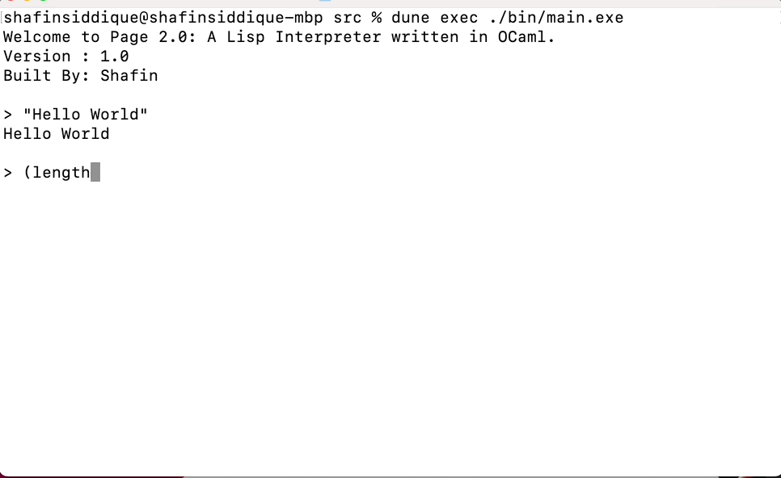

## Welcome to Page2.0

### A Lisp Interpreter Written in OCaml.
This is a 'sequel' to my original interpreter,'Page', which was written in Go. Yes, I really like Lisp .. and interpreters. The interpreter uses a recursive descent parser. Here's a short demo:




### Documentation

##### 1. Lists

```
> (list 1 2 3) // define list.
(list 1 2 3)

> (car (list 1 2 3)) // get first element
1

> (cdr (list 4 5 6)) // get rest
(list 5 6)

> (cons 1 (list 4 5 6)) // construct new list with elements combined
(list 1 4 5 6)

> (length (list 1 2 3))
3
```


##### 3. Strings

```
> (length "hello")
5

> (equals "hello" "world")
False

> "Hello World"
Hello World
```

##### 3. Numbers

```
> 10
10

> (+ 5 5 )
10

> (% 4 2)
0

> (/ 4 2)
2

> (* 2 2)
4
```
